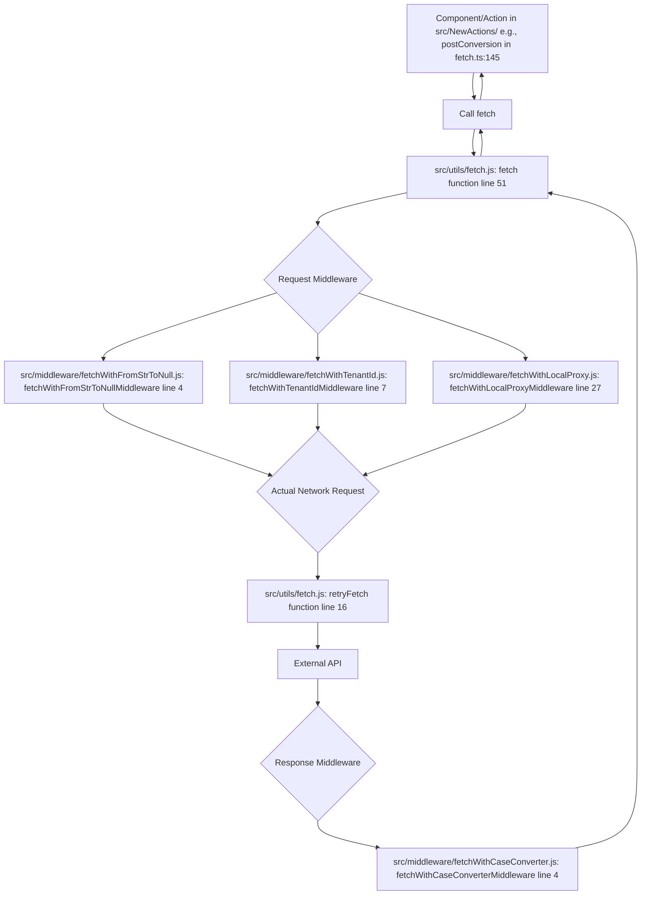

# Network Request Architecture
### Cursor Prompt
```text
Show me a diagram of a simple network request made in this project, include file names, functions, and lines of code.
```
---
### Output

```mermaid
graph TD
    A[Component/Action in src/NewActions/ e.g., postConversion in fetch.ts:145] --> B[Call fetch];
    B --> C[src/utils/fetch.js: fetch function line 51];
    C --> D{Request Middleware};
    D --> E[src/middleware/fetchWithTenantId.js: fetchWithTenantIdMiddleware line 7];
    D --> F[src/middleware/fetchWithFromStrToNull.js: fetchWithFromStrToNullMiddleware line 4];
    D --> G[src/middleware/fetchWithLocalProxy.js: fetchWithLocalProxyMiddleware line 27];
    F --> H{Actual Network Request};
    E --> H;
    G --> H;
    H --> I[src/utils/fetch.js: retryFetch function line 16];
    I --> J[External API];
    J --> K{Response Middleware};
    K --> L[src/middleware/fetchWithCaseConverter.js: fetchWithCaseConverterMiddleware line 4];
    L --> C;
    C --> B;
    B --> A;
```