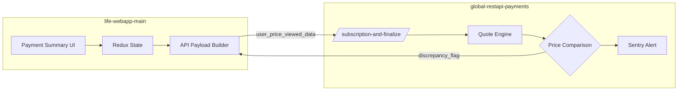
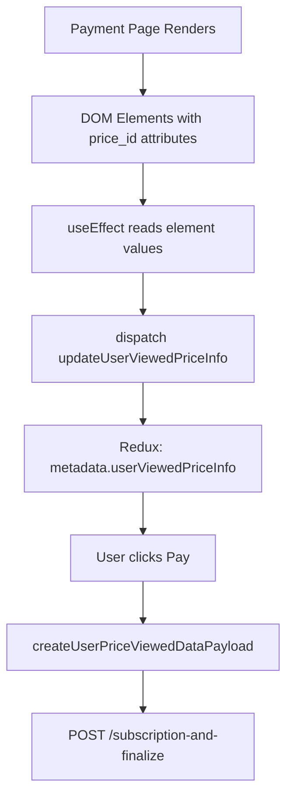
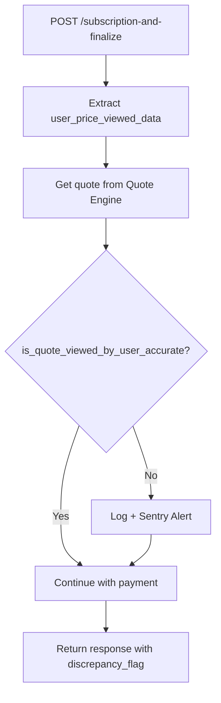

# Price Discrepancy Alert System

A system to detect mismatches between the price displayed to users in the UI and the price calculated by the backend quote engine.

## Goal

Ensure users are charged exactly what they see on the payment page. If a discrepancy is detected, a Sentry alert is triggered for investigation.

---

## How It Works

When a user reaches the Stripe payment page, the frontend captures the exact price values rendered in the DOM and stores them in Redux. When the user submits payment, these captured prices are sent to the backend alongside the payment details. The backend independently computes the expected price using the quote engine, then compares it against what the frontend reported. If the values don't match (beyond a $0.01 tolerance), the system logs the discrepancy and fires a Sentry alert for investigation. The payment still proceeds, but the response includes a `discrepancy_flag` for monitoring.



---

### 1. Frontend (life-webapp-main)

On the Stripe payment page, the system:

1. **Captures DOM values** - Uses `useEffect` hooks to read rendered price elements via their IDs (defined in `GET_PRICING_ELEMENTS_IDS_FOR_REPORTING`)
2. **Stores in Redux** - Dispatches `updateUserViewedPriceInfo` to save captured values to `state.metadata[userType].userViewedPriceInfo`
3. **Creates payload** - When submitting payment, `createUserPriceViewedDataPayload()` constructs an array of price segments with `start_idx`, `end_idx`, and `value`
4. **Sends with payment** - The `user_price_viewed_data` is included in the subscription/finalize API call

**Key Files:**

- `src/components/PaymentSummary/const.ts` - Element IDs for price tracking
- `src/components/PaymentSummary/NewPaymentSummaryFrame.tsx` - Captures discount info
- `src/components/PaymentSummary/NewProductRow.tsx` - Captures per-product prices
- `src/utils/helpers.ts` - `createUserPriceViewedDataPayload()` function
- `src/NewActions/handle.ts` - `getPostCreateStripeSubscriptionsAndFinalizePayload()` integrates it



---

### 2. Backend (global-restapi-payments)

On receiving a payment request, the system:

1. **Receives payload** - Extracts `user_price_viewed_data` from the request
2. **Gets quote engine price** - Calls `get_quote_with_debits_and_discounts()` or `get_hd_quotes_total()` to compute expected price
3. **Compares prices** - `is_quote_viewed_by_user_accurate()` compares FE vs BE prices with tolerance of `0.01`
4. **Alerts on mismatch** - If discrepancy found, logs info and sends Sentry error

**Key Files:**

- `app/blueprints/payment.py` - Endpoints calling the comparison
- `app/utils/helpers.py` - `is_quote_viewed_by_user_accurate()`, `_are_life_ci_prices_accurate()`, `_are_hd_prices_accurate()`



---

### 3. ITT (Internal Tool Testing) Integration

The discrepancy check is integrated into ITT Cypress tests to validate price consistency during automated testing.

**Location:** `cypress/support/newProductCommands.js`

The tests intercept the subscription response and check `discrepancy_flag`:

```javascript
cy.wait('@createLifeCISubscription').then((interception) => {
  cy.log('discrepancy_flag response => ', interception.response.body.data);
  // expect(interception.response.body.data.discrepancy_flag).to.be.false;
});
```

#### Current State (as of Dec 2025)

| Component        | Status                         |
| ---------------- | ------------------------------ |
| FE Price Capture | ✅ **Active**                   |
| BE Comparison    | ✅ **Active**                   |
| Sentry Alerts    | ✅ **Active**                   |
| ITT Assertions   | ⚠️ **Disabled** (commented out) |

> **Note:** The ITT `expect()` assertions are commented out, so tests will **log** the discrepancy flag but will **not fail** on mismatches. This was intentional to avoid blocking CI while we iron out the implementation, to be enabled in https://policyme.atlassian.net/browse/PART-2351.

---

## Price Segment Structure

The FE sends an array of price segments:

```typescript
interface UserPriceViewedData {
  start_idx: number; // Start month index (0-based)
  end_idx: number; // End month index (exclusive)
  value: number; // Monthly price for this period
}
```

**Example for Life with joint discount:**

```json
[
  { "start_idx": 0, "end_idx": 12, "value": 85.0 },
  { "start_idx": 12, "end_idx": 240, "value": 100.0 }
]
```

---

## Tracked Discounts

| Discount Type             | Product  | Field ID                                  |
| ------------------------- | -------- | ----------------------------------------- |
| CAA Member                | All      | `caa_discount_savings_applied`            |
| CAA Family                | HD       | `family_discount_savings_applied`         |
| Joint                     | Life     | `joint_discount_savings_applied`          |
| Exclusive Perk (2mo free) | Life, CI | `exclusive_perk_discount_savings_applied` |

---

## Response Payload

The backend returns `discrepancy_flag` in the response:

```json
{
  "policy_id": "...",
  "subscription_id": "...",
  "discrepancy_flag": false
}
```

- `false` = Prices match
- `true` = Discrepancy detected (Sentry alert sent)

---

## Related PRs

- [PR #11840](https://github.com/policyme/life-webapp-main/pull/11840) - FE price capture implementation
- [PR #11868](https://github.com/policyme/life-webapp-main/pull/11868) - ITT discrepancy check integration
