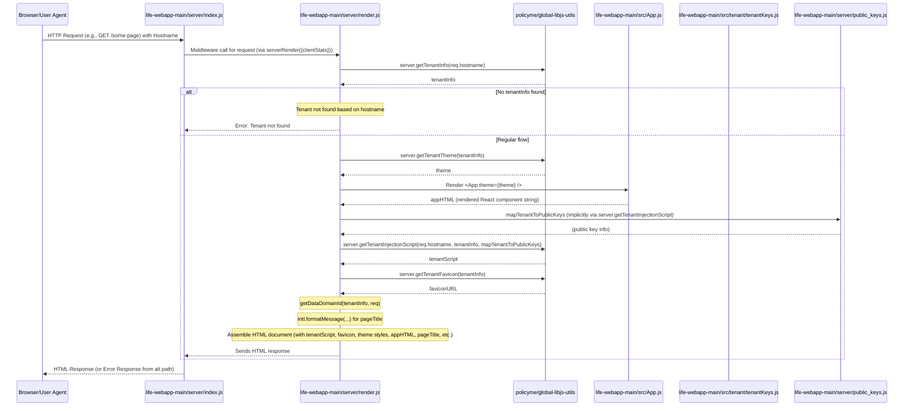

# How is a Tenant Rendered?
> [!IMPORTANT]
> This may not render on you GH as you need it, navigate to https://www.mermaidchart.com/play and enter the markdown.
### Cursor Prompt
```text
Show me a diagram of how a tenant is booted, include file names, project name, functions, and lines of code.
```
---
### Output

